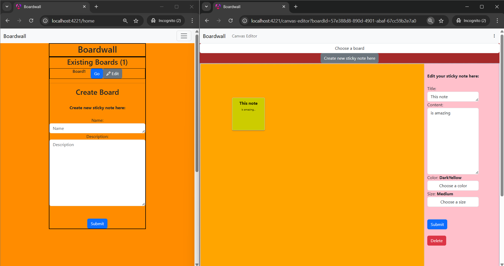

# Boardwall



Boardwall is a virtual information boards and sticky notes system. It is categorized as content management system.
It is great for brainstorming ideas and creating todos. You own your data as well.

It can be run using docker or run via yarn/node/angular dev.

So as a pre-requisite, you need to have docker, docker buildx, docker compose installed on your system:
1. Linux
2. MacOS via colima
3. Windows via WSL

Run the following shell script:
```sh
curl -fsSL https://raw.githubusercontent.com/mj-silverio/boardwall/main/scripts/get-boardwall.sh | bash
```

It will create .env.1 file as well (which is done automatically):
```
# SERVER_PORT=8080
DB_HOST=db
DB_PORT=5432
DB_USERNAME=postgres
DB_PASSWORD=postgres
BASE_FRONTEND_URLS="http://localhost:4221,http://$HOST_IP:4221"
API_URL="http://$HOST_IP:8888/api/v1"
```

There are two modes to run it:

(1) Basic docker setup
(2) Docker compose setup

## Contributing / Testing

Create .env.dev
```
# SERVER_PORT=8080
DB_HOST=localhost
DB_PORT=8432
DB_USERNAME=postgres
DB_PASSWORD=postgres
BASE_FRONTEND_URLS="http://localhost:4200"
API_URL="http://localhost:8080/api/v1"
```
task run:backend
task run:frontend