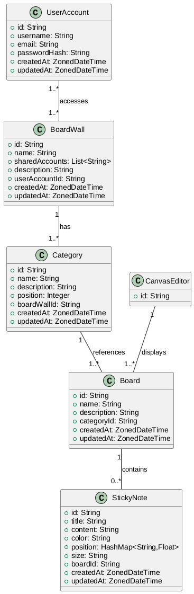
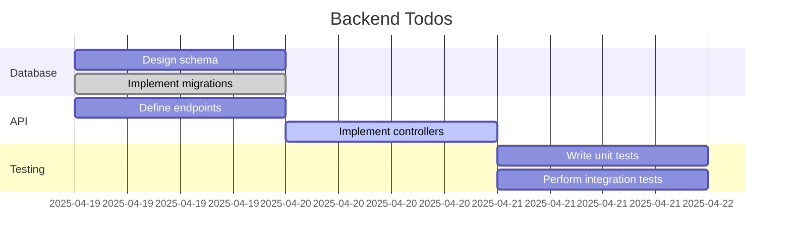

# Boardwall Backend

Type: `Springboot Application - Java 17, jar file`

1. DB: `Postgres`
2. JDBC DB driver: `postgres-driver`
3. PORT: `8001`

## Swagger UI / Open API 3 Springdocs

Go to: `http://localhost:8080/swagger-ui/index.html`

## Design

## Todos in Gantt

## Done:

1. Apply Openapi Swagger for java app

## Continue:

1. Fix Cors, learn from orange-moon
2. Adjustments in zoned date time
3. Apply Redis caching for pagination
