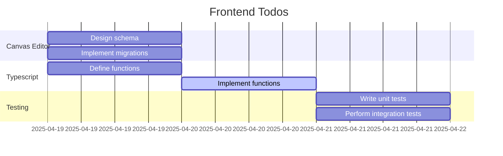

# Boardwall

## Angular Material Library
1. https://primeng.org/installation
2. https://v17.primeng.org/dropdown
3. https://v17.primeng.org/colorpicker

## Angular CDK Drag and Drop
Ref: `https://material.angular.io/cdk/drag-drop/examples`

1. [Drag&Drop boundary](https://material.angular.io/cdk/drag-drop/examples#cdk-drag-drop-boundary)
2. Programmatically setting the free drag position
3. Basic Drag&Drop

## References:

1. https://medium.com/@desinaoluseun/using-env-to-store-environment-variables-in-angular-20c15c7c0e6a

## Todos in Gantt

## Done:

1. Create services that will consume 5 API V1 controller endpoints
2. Print out results and translate to sticky notes
3. Use PM2 instead of nginx
4. Boardwall hierarchy
5. Flexbox of main-menu (left,center,right)
6. Update UI after update sticky notes
7. Pipe fix
8. routing frontend from board id to canvas-editor, click cell redirect to canvas editor
9. position sync services
10. Display sticky note panel div
11. Small (200), Medium (300), Large (400) sticky note

## Continue:

1. Hide delete board (context and modal)
2. Boardwall import from file zip of boards for loop
3. Existing boards pagination by 12's based on categories and search

## Queue:
1. Static util Functions for color palette (6), 
2. Toolbar - Copy to clipboard
3. Option to display 2 or 3 boards in canvas
4. Nice landing app menu, Category filter display
5. Canvas view - Boards display and Sticky Note Update
6. Edit mode switcher

## Infra
1. Create k8s deployment and CI/CD pipelines as portfolio for client using AWS software architecture
